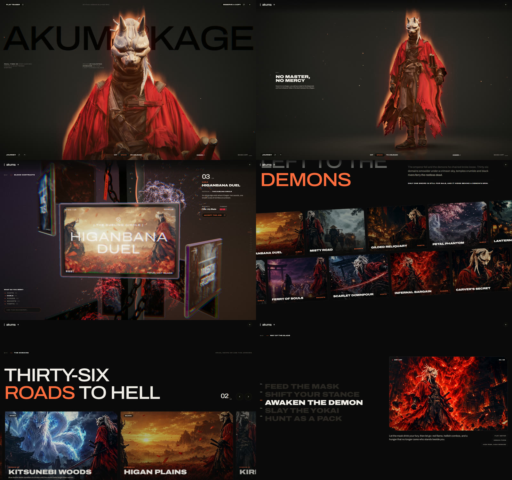

# AKUMA® KAGE — 3D Game Landing Page

An interactive, scroll-driven 3D website for a fictional dark-fantasy demon-slayer game.
A masked warrior walks in real time on a reflective floor while the camera circles him,
fourteen glass "blood contract" cards spiral around a giant cursed katana, and the whole
page is scored by a soundtrack the browser composes on the fly.

Built with plain HTML, CSS and JavaScript modules. No build step and no `npm install`.

---

## Requirements

| What | Why | Notes |
| --- | --- | --- |
| A local web server | Browsers block 3D models and JS modules on `file://` | Python 3 (recommended), or any static server |
| A modern browser with WebGL 2 | 3D rendering | Chrome, Edge, Firefox, or Safari 15+ |
| Internet connection | Libraries and fonts load from CDNs | three.js, GSAP, Lenis, Google Fonts |
| A GPU (any recent laptop/phone) | Smooth 60 fps | The site lowers its resolution on slow devices |

Check that Python is installed:

```bash
python --version
```

If it isn't, install it from <https://www.python.org/downloads/> and tick "Add Python to PATH" during setup.

---

## How to run

### Option 1: double-click (Windows)

Double-click `start.bat`. It starts a server, opens the site in your browser, and prints a link for your phone.
Keep the black window open while you browse; press `Ctrl + C` in it to stop.

### Option 2: terminal (Windows / macOS / Linux)

```bash
cd "path/to/3D website"
python -m http.server 8080
```

Then open <http://localhost:8080>.

### Option 3: other servers

Any static server works, for example:

```bash
npx serve .          # Node.js
```

or the Live Server extension in VS Code (right-click `index.html` → Open with Live Server).

### Open it on your phone

1. Connect the phone to the same Wi-Fi as the computer.
2. Run `start.bat` (or `python -m http.server 8080 --bind 0.0.0.0`).
3. On the phone, open `http://<your-computer-IP>:8080`. `start.bat` prints this address for you.

If the page won't load on the phone, allow Python through the Windows Firewall, or use your phone's hotspot
(some office/college networks block devices from talking to each other).

---

## Controls

| Action | What happens |
| --- | --- |
| Enter with music / Enter in silence | Opens the site (browsers need a click before audio can play) |
| Scroll | The camera orbits the warrior, then moves through each section |
| Move the mouse | The warrior turns his head to follow the cursor |
| `Space` (or tap the key button) | Unleash / restrain the demon: red aura, embers, lighting change |
| Hover a contract card | The frosted glass melts away to reveal the painting |
| Drag / swipe the Domains slider | Flick through the ten domains; arrows and ← → keys work too |
| Music button (bottom right) | Turn the soundtrack on or off |

---

## Sections

1. Opening: a katana spins in over drifting embers; on enter it slashes the screen in two.
2. Hero: giant AKUMA® KAGE wordmark behind a walking 3D warrior; scroll to orbit 360°.
3. The Realm: title plus two endless rows of paintings that speed up with your scroll.
4. Blood Contracts: 14 glass cards spiralling down a procedural katana, with a search box and category filter.
5. Way of the Blade: five gameplay pillars with key art.
6. The Domains: draggable slider with inertia, parallax and autoplay.
7. Pacts: three pre-order editions with a live launch countdown.
8. Footer: newsletter form and links.

---

## Project structure

```
3D website/
├── index.html            Page markup and section content
├── start.bat             One-click local server (Windows)
├── css/
│   └── style.css         All styles (dark theme, layout, responsive rules)
├── js/
│   ├── main.js           App entry: loader, scroll, menus, sections, slider
│   ├── hero.js           Hero 3D scene: camera path, lights, floor, moods
│   ├── walk.js           Procedural walk cycle with two-bone leg IK
│   ├── wordmark.js       Draws the HTML wordmark inside WebGL (behind the warrior)
│   ├── post.js           Post-processing: aura flames, bloom, lens, film grain
│   ├── services-scene.js Glass-card spiral scene
│   ├── katana.js         Procedurally modelled katana, chains and talismans
│   ├── audio.js          Procedural soundtrack (taiko, koto, flute, drone)
│   └── data.js           All text content: contracts, features, domains
├── models/
│   └── akuma-warrior.glb Rigged 3D character
├── media/
│   ├── services/         Card art (.webp), small versions in sm/, 3 looping videos
│   └── editions/         Pre-order edition covers
└── docs/
    └── preview.jpg       Screenshot used below
```

---

## Customising

| I want to… | Edit |
| --- | --- |
| Change card titles, clients, rewards or descriptions | `js/data.js` → `SERVICES` |
| Change the slider domains | `js/data.js` → `DOMAINS` |
| Change the Way of the Blade text | `js/data.js` → `FEATURES` |
| Change headings, prices, footer links | `index.html` |
| Change colours | `css/style.css` → `:root` variables (`--accent`, `--bg`, …) |
| Use your own song | In `js/main.js`, change `new Soundtrack({ button: … })` to `new Soundtrack({ button: …, src: 'audio/your-song.mp3' })` and put the file in an `audio/` folder |
| Replace a picture | Overwrite the matching file in `media/services/` (keep the same name, `.webp`, roughly 1000 px wide) |
| Change the launch date | `js/main.js` → `LAUNCH` |

---

## Tech stack

- [three.js](https://threejs.org/) 0.166: WebGL rendering, GLTF loading, post-processing
- [GSAP](https://gsap.com/) 3.12 + ScrollTrigger: animation and scroll timelines
- [Lenis](https://lenis.darkroom.engineering/) 1.1: smooth scrolling
- [Archivo](https://fonts.google.com/specimen/Archivo) and Noto Serif JP: Google Fonts
- Web Audio API: the soundtrack is generated in the browser, no audio file is needed

All libraries load from the jsDelivr CDN through the import map in `index.html`.

---

## Deploying

The folder is a static site, so you can upload it as-is:

- Netlify: drag the folder onto <https://app.netlify.com/drop>
- Vercel: `npx vercel` inside the folder
- GitHub Pages: push the folder to a repository and enable Pages on the main branch

---

## Troubleshooting

| Problem | Fix |
| --- | --- |
| Blank page or "Could not load the warrior" | You opened `index.html` directly. Run it through a server (see How to run). |
| Stuck at 0% | Check your internet connection; the libraries come from a CDN. |
| Choppy on an old laptop | Close other tabs; the site lowers its resolution automatically after a few seconds. |
| No sound | Click Enter with music or the music button; browsers block audio until you click. |

---

## Preview


